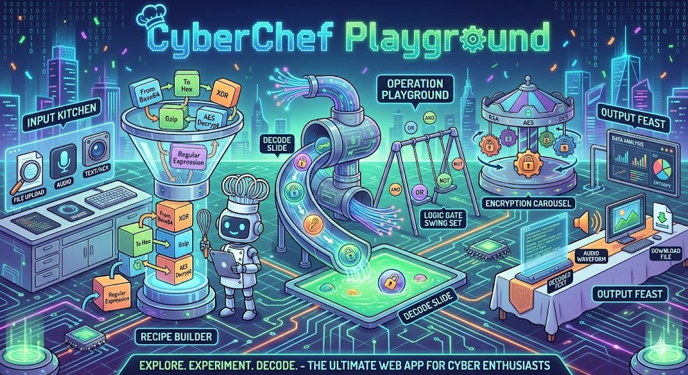

<p align="center">
  
</p>

<p align="center">
  
  
  
  
  
</p>

<p align="center">
  A self-hosted CTF-style challenge platform for learning cryptography, encoding, and log analysis — powered by CyberChef recipes.
</p>

---

## Table of Contents

- [Features](#features)
- [Architecture](#architecture)
- [Quick Start](#quick-start)
- [Game Modes](#game-modes)
- [How to Play](#how-to-play)
- [Supported Recipe Formats](#supported-recipe-formats)
- [How Validation Works](#how-validation-works)
- [Project Structure](#project-structure)
- [Adding Challenges](#adding-challenges)
- [Technical Details](#technical-details)
- [References](#references)

---

## Features

| Feature | Description |
|---------|-------------|
| **Two Game Modes** | `linear` — sequential unlock; `jeopardy` — open category board |
| **4 Recipe Formats** | Deep Link, Clean JSON, Compact JSON, Chef Format |
| **Format Auto-detect** | Paste any format — the dropdown switches automatically |
| **Keyboard Shortcut** | `Ctrl+Enter` / `Cmd+Enter` submits instantly |
| **Flag System** | Earn flags per challenge; one-click copy to clipboard |
| **Solved Stamps** | Completed challenges visually marked on the board |
| **Mobile-friendly** | Responsive layout with collapsible sidebar |
| **Separated Challenge Repo** | Challenges live in [CCPG-Challenges](https://github.com/ChickenLoner/CCPG-Challenges) — keeps this repo clean from binaries and malware samples |
| **KAPE-style Sync** | `npm run sync` pulls latest challenges from CCPG-Challenges |
| **Flow Control Support** | Fork, Merge, Subsection, Register, Label, Jump, Conditional Jump, Return — the full CyberChef recipe language |
| **No Browser Needed** | Pure Node.js with cyberchef-node (300+ operations server-side) |
| **Docker Ready** | Challenges cloned at build time; no manual setup required |

---

## Architecture

Inspired by [KAPE's KapeFiles](https://github.com/EricZimmerman/KapeFiles) two-repo model:

| Repo | Purpose |
|------|---------|
| **CyberChef-Playground** *(this repo)* | Application code — server, frontend, Docker config |
| **[CCPG-Challenges](https://github.com/ChickenLoner/CCPG-Challenges)** | Challenge content — binaries, encrypted samples, validation files, solutions |

Challenges are **never committed here**. This protects the main repo from GitHub flagging CTF binaries or malware samples as malicious content.

---

## Quick Start

### Option 1: Docker (Recommended)

Challenges are automatically cloned from CCPG-Challenges during the image build. No manual steps needed.

**Prerequisites:** [Docker Desktop](https://www.docker.com/products/docker-desktop/) installed and running.

```bash
# Build and start
docker compose up --build -d

# View logs
docker compose logs -f

# Stop and remove
docker compose down
```

Access at **http://localhost:8080**

| Problem | Fix |
|---------|-----|
| `port already in use` | Stop whatever is using port 8080, or change the port in `docker-compose.yml` |
| `cannot find the file specified` | Docker Desktop isn't running |

---

### Option 2: Local with npm

```bash
# Install dependencies
npm install

# Sync challenges (clones on first run, pulls on subsequent runs)
npm run sync

# Start
npm start          # production
npm run dev        # development (auto-restart on changes)
```

Access at **http://localhost:3000**

> Re-run `npm run sync` anytime to pull new challenges — no server restart needed.

---

## Game Modes

Set the mode in `ccpg.config.json` at the project root:

### Linear Mode

Players unlock challenges one at a time — solve `N` to unlock `N+1`.

```json
{ "mode": "linear" }
```

### Jeopardy Mode

All challenges open at once on a category board, just like a real CTF.

```json
{ "mode": "jeopardy" }
```

> The `category` field in each `challenge.json` groups challenges on the board.
> Challenges without a category appear under **General**.
> Defaults to `linear` if no config file exists.

---

## How to Play

1. Open **http://localhost:8080** (Docker) or **http://localhost:3000** (npm)
2. Download the challenge files
3. Analyse the encryption or encoding in the sample
4. Build your decryption recipe in [CyberChef](https://gchq.github.io/CyberChef/)
5. Submit your recipe and claim the flag

**Tips:**
- Press `Ctrl+Enter` (or `Cmd+Enter` on Mac) to submit without leaving the keyboard
- Paste any recipe format — the format selector auto-detects Deep Link, JSON, or Chef Format
- Use the **Deep Link** workflow (copy the browser URL from CyberChef) for the fastest round-trip
- Try the **Magic** operation when you're unsure about encoding
- Read hints carefully — they point directly to the right operation

---

## Supported Recipe Formats

All four formats exported by CyberChef are accepted.

### Deep Link *(Recommended)*

Copy the URL straight from the CyberChef browser tab:

```
https://gchq.github.io/CyberChef/#recipe=XOR(%7B'option':'Hex','string':'42'%7D,'Standard',false)&input=...
```

### Clean JSON

**CyberChef → Save recipe → Clean JSON:**

```json
[
  {
    "op": "XOR",
    "args": [{"option": "Hex", "string": "42"}, "Standard", false]
  }
]
```

### Compact JSON

**CyberChef → Save recipe → Compact JSON:**

```json
[{"op":"XOR","args":[{"option":"Hex","string":"42"},"Standard",false]}]
```

### Chef Format

**CyberChef → Save recipe → Chef format:**

```
XOR({'option':'Hex','string':'42'},'Standard',false)
```

---

## How Validation Works

```
Player submits recipe (any of 4 formats)
         ↓
Server parses it into CyberChef JSON
         ↓
Flow control engine executes recipe op-by-op
  ├── Regular ops  →  cyberchef-node (300+ operations)
  └── Flow control →  custom engine (Fork, Merge, Jump, Register, Subsection…)
         ↓
Runs player's recipe on the hidden validation file  →  raw bytes
Runs solution recipe on the same file              →  expected bytes
         ↓
SHA256(player output) == SHA256(expected output)?
  ✅ Match    →  Award flag, unlock next (linear) / mark solved (jeopardy)
  ❌ No match →  Show hint
```

Validation is **byte-exact** — works for binary files, shellcode, PE/ELF, PCAP payloads, and plain text. The solution recipe is never sent to clients.

---

## Project Structure

```
CyberChef-Playground/          ← This repo
├── server.js                  ← Express API server
├── flow-control.js            ← Flow control engine (Fork, Merge, Jump, Register…)
├── sync.js                    ← Challenge sync script
├── ccpg.config.json           ← Mode config (linear | jeopardy)
├── public/
│   └── index.html             ← Frontend SPA (single file, no build step)
├── .ccpg-challenges/          ← Gitignored — created by npm run sync
│   └── challenges/
│       ├── xor-warmup/
│       ├── base64-layering/
│       └── ...
├── Dockerfile
└── docker-compose.yml

CCPG-Challenges/               ← Separate repo
└── challenges/
    └── xor-warmup/
        ├── challenge.json     ← Metadata (id, name, hint, flag, category…)
        ├── solution.json      ← Solution recipe — server-side only
        ├── xor_challenge.zip  ← Player download
        └── validation.bin     ← Validation input — never exposed to players
```

---

## Adding Challenges

Challenges live in [CCPG-Challenges](https://github.com/ChickenLoner/CCPG-Challenges). See [CTF_AUTHOR_GUIDE.md](CTF_AUTHOR_GUIDE.md) for the full walkthrough.

**Quick steps:**

1. Create `CCPG-Challenges/challenges/<your-slug>/`
2. Add `challenge.json` (metadata with `id`, `category`, `hint`, `flag`) and `solution.json` (CyberChef recipe)
3. Add player download files and a separate `validation.bin` (server-side only)
4. Push to CCPG-Challenges — players sync with `npm run sync`

---

## Technical Details

| Component | Detail |
|-----------|--------|
| **Backend** | Express.js 4.18, Node.js ≥18 (ES modules, top-level await) |
| **CyberChef engine** | cyberchef-node v2.0.3 — 300+ operations, no browser required |
| **Flow control engine** | Custom `flow-control.js` — Fork, Merge, Subsection, Register, Label, Jump, Conditional Jump, Return, Comment |
| **Session management** | In-memory `Map` with 2-hour TTL; idle sessions evicted every 30 min |
| **Challenge discovery** | Scans all subdirectories of `CHALLENGES_DIR`, loads `challenge.json`, sorts by `id` |
| **Validation** | SHA256 of raw byte output — constant-time comparison |
| **Security** | No `innerHTML` with user data, path traversal prevention, validated filenames on download |

---

## References

- [CyberChef](https://github.com/gchq/CyberChef) — The original tool by GCHQ
- [cyberchef-node](https://github.com/nicowillis/cyberchef-node) — Node.js CyberChef wrapper
- [CCPG-Challenges](https://github.com/ChickenLoner/CCPG-Challenges) — Challenge content repo
- [KAPE](https://github.com/EricZimmerman/KapeFiles) — Inspiration for the two-repo model

---

## Contributing

- **New challenges** → contribute to [CCPG-Challenges](https://github.com/ChickenLoner/CCPG-Challenges)
- **App improvements** → open a PR in this repo

---

<p align="center">
  Built for educational and defensive security training purposes.<br/>
  CyberChef is developed by <a href="https://github.com/gchq">GCHQ</a>.
</p>
